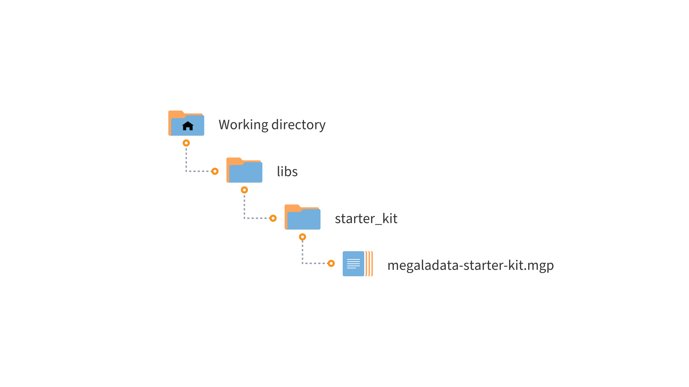

# Megaladata Starter Kit

* Version: 1.1.2
* Verified: All editions of Megaladata 7.1.0

Megaladata starter kit library is supported and developed by Megaladata. It offers simple and useful components that ease the routine work of an analyst in developing data processing scripts. The components of the library are widely used in the company's electronic courses and component libraries for business courses.

## Installation

1. Define the working directory where your libraries will be located:

   * For server editions — in the Megaladata Server working directory (in the user folder or in the common users folder);
   * For desktop editions — in any folder on the local disk.

2. Create a subdirectory called **libs** in it.

3. Place the **megaladata-starter-kit** folder in the **libs** directory.

4. Add a reference to the **megaladata-starter-kit.mgp** package in your package and use the library components.

## Requirements

To use the **Megaladata Starter Kit** library, you need:

* Installed Megaladata software. Version no lower than 7.1.0.

## Components List

### ETL and Data Preparation

* [ABC analysis](./docs/abc-analysis.md)
* [ABC analysis (method of tangents)](./docs/abc-analysis-method-of-tangents.md)
* [XYZ analysis](./docs/xyz-analysis.md)
* [Period selection](./docs/period-selection.md)
* [Rare values](./docs/rare-values.md)
* [Fragmentation](./docs/fragmentation.md)
* [Row splitter](./docs/cell-splitter.md)
* [Row splitter (variables)](./docs/cell-splitter-variables.md)
* [Event labeling](./docs/event-labeling.md)
* [Objects sampling](./docs/objects-sampling.md)
* [Popular objects](./docs/popular-objects.md)

### Data Mining

* [AUC](./docs/auc.md)
* [ROC analysis](./docs/roc.md)
* [Cluster silhouettes](./docs/cluster-silhouettes.md)
* [Clustering comparison](./docs/comparison-of-clustering.md)
* [Metrics comparison](./docs/comparison-of-metrics.md)
* [Statistical significance](./docs/statistical-significance.md)
* [Classification metrics](./docs/classification-metrics.md)
* [Trivial model](./docs/trivial-model.md)
* [IV selection](./docs/iv-sampler.md)

### Utilities

* [Calendar generator](./docs/calendar-generator.md)
* [Date shift](./docs/dates-shift.md)
* [Joining JS Columns](./docs/column-union.md)
* [JSON Parser](./docs/parse-json.md)
* [Percentile N%](./docs/percentile-n.md)
* [Empty fields generator](./docs/empty-fields-generator.md)
* [List generator](./docs/list-generator.md)
* [Category to number](./docs/category-to-number.md)
* [Date difference](./docs/dates-difference.md)
* [Random category JS](./docs/random-category.md)
* [Column filter JS](./docs/column-filter.md)
* [Column filter JS (Regex)](./docs/column-filter(Regex).md)
* [IF union JS](./docs/if-union.md)
* [Column list JS](./docs/columns-list.md)