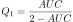
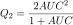
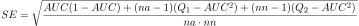
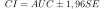
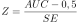

# AUC

[Back to the list of components](../README.md)

## Purpose

Designed to calculate the AUC index, standard error, confidence intervals, and Z-score for evaluating model quality.

It includes a verbal assessment of the model's quality. The results are displayed in variables.

## Input Ports

| Name  | Type        |
|:----------------|:-----------|
| Actual and estimated values | Table    |
| Algorithm parameters  | Variables |

### Structure of the table "Actual and estimated values"

| Caption   | Type                                    | Description      |
|:--------|:----------------|:-----------|
| Event |  Logical      | true corresponds to an event, false corresponds to a non-event                            |
| Estimate  |  Float | The score given by the algorithm (probability, score, rating, reliability, etc.) |

### Variables in the "Algorithm Parameters"

| № | Caption    | Type                          | Value   |
|:--|:---------|:-----------------------------|:-----------|
| 1 | Accuracy |  Integer | 4          |

Accuracy — the precision of calculating the output values (decimal places). It affects the calculation speed: the higher the precision, the longer the calculations.

## Output ports

| Name   | Type        |
|:-----------|:-----------|
| Results | Variables |

### Variables in the "Results" port

| № | Caption                          | Type                                    | Description                                               |
|:--|:---------------|:---------|:---------|
| 1 | AUC Curve    |  Float | Calculated AUC index value for the model           |
| 2 | Quality                       |  String        | Verbal description of model quality (see **Algorithms**)|
| 3 | Standart error             |  Float | Standard deviation for the set                       |
| 4 | AUC lower confidence interval  |  Float | Lower limit of the confidence interval                |
| 5 | AUC upper confidence interval |  Float | Upper limit of the confidence interval              |
| 6 | Z-Estimate                      |  Float | Calculated Z-score value                         |

## Algorithms

### AUC Index

The standard algorithm for calculating the area under the curve is used. Cumulative contribution of events and non-events are calculated for each change in the output variable **Estimate**, previously rounded to **(Accuracy + 1)** decimal places.

### Quality

The text field is based on the following rules.

|  AUC Interval	 | Model Quality      |
|:--------------|:---------------------|
|         > 0,9 | Great             |
| [ 0,8 - 0,9 ] | Very Good        |
| ( 0,7 - 0,8 ] | Good              |
| ( 0,6 - 0,7 ] | Average              |
|        <= 0,6 | Unsatisfactory |

### Standard error

It is calculated using the method [**Hanley & McNeil, 1982**]<a href="#1">1</a>.

The calculations are as follows:

### Confidence Interval

The boundaries of the confidence interval for AUC are calculated as follows:

### Z-Estimate

The calculations look like this:

The critical value for the z-estimate for a significance level of 95% is considered to be 1,96. If *|z|* > 1,96,  then the hypothesis about the randomness of the area under the curve estimate (*AUC* = 0,5) is rejected.