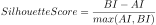
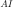
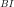

# Cluster silhouettes

[Back to the list of components](../README.md)

## Purpose

Allows the creation of a dataset for the graphical construction of cluster silhouettes and conducting an overall assessment of the quality of clustering performed by an external algorithm. The component carries out:

* calculation of the silhouette evaluation index for a given number of points (but no more than 1000);
* calculation of the silhouette index for each cluster;
* calculation of the silhouette index for the entire clustering;
* formation of a clustering quality label.

The external clustering algorithm should be based on some centroidal method (i.e., operate with the concept of a cluster center), for example, the k-means algorithm.

## Input Ports

| Name             | Type        |
|:-----------------|:-----------|
| Objects Table    | Table      |
| Variables        | Variables  |

### Structure of the "Objects Table"

| Caption           | Type                                      | Description                                                                       |
|:----------------|:-----------------------------------------|:----------------------------------------------------------------------------------|
| Cluster Number  |  Integer            | Number of the cluster to which the object belongs                                 |
| ID      |  String              | Object identifier                                                                 |
|             |  String              | Name of the field containing the cluster object's characteristic value            |
| Value           |  Float  | Field value                                                                      |

### Variables in the "Variables" Port

| № | Caption                | Type                                 | Value    |
|:--|:---------------------|:------------------------------------|:---------|
| 1 | Data Standardization |  Logical       | true     |

**Data Standardization** — a flag whereby values will be standardized. By default, **true**.

## Output Ports

| Name                  | Type        |
|:----------------------|:-----------|
| Cluster Silhouettes   | Table       |
| Silhouette indexes    | Table       |
| Clustering Quality    | Variables   |

### Structure of the "Cluster Silhouettes" Table

| Caption                  | Type                                      | Description                                                                  |
|:-----------------------|:-----------------------------------------|:-----------------------------------------------------------------------------|
| Row Number             |  Integer            | Sequential row number                                                        |
| Cluster Number         |  Integer            | Number of the cluster to which the object belongs                            |
| ID             |  String              | Object identifier                                                            |
| Silhouette Score |  Float | Silhouette evaluation index value for the object                             |

The table is sorted in ascending order of cluster number and descending silhouette index.

### Structure of the "Silhouette Indexes" Table

| Caption           | Type                                      | Description                  |
|:----------------|:-----------------------------------------|:-----------------------------|
| Cluster Number  |  Integer            | Unique cluster number        |
| Silhouette Index|  Float  | Cluster silhouette index     |

### Variables in the "Clustering Quality" Port

| № | Caption                   | Type                                      | Description                                                            |
|:--|:------------------------|:-----------------------------------------|:-----------------------------------------------------------------------|
| 1 | Silhouette index        |  Float  | Clustering silhouette index value                                      |
| 2 | Quality      |  String              | Interpretation of the silhouette index value, see **Algorithms**       |

## Algorithms

General description ([link 1](https://en.wikipedia.org/wiki/Silhouette_%28clustering%29)) and a detailed algorithm with implementation in Python ([link 2](http://scikit-learn.org/stable/auto_examples/cluster/plot_kmeans_silhouette_analysis.html#sphx-glr-download-auto-examples-cluster-plot-kmeans-silhouette-analysis-py)).

1. The Silhouette Evaluation Index **SilhouetteScore** is calculated by the formula:

    , where:

    *  — Distance to the cluster center;
    *  — Distance to the neighboring cluster center.

2. The average value of the **SilhouetteCoefficient** varies from -1 to 1.

3. The label indicating clustering quality is formed according to the rule:

    * Clustering Quality is **Low** if **SilhouetteCoefficient** < 0.2;
    * Clustering Quality is **Medium** if **SilhouetteCoefficient** is in the range [0.2, 0.5);
    * Clustering Quality is **High** if **SilhouetteCoefficient** > 0.5.
