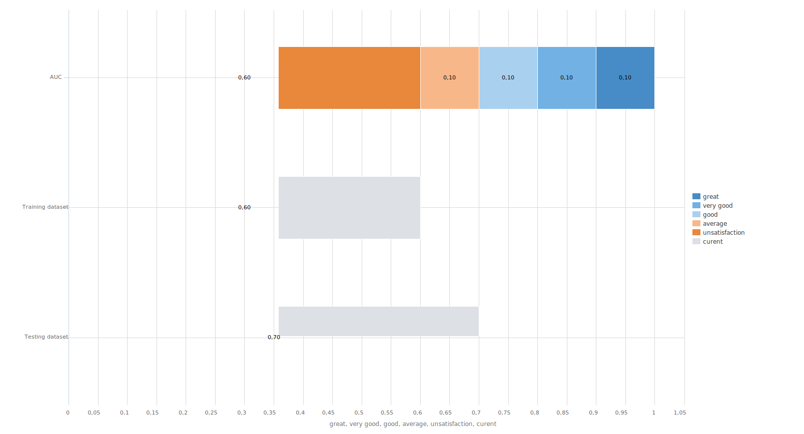

# Metrics comparison

[Back to the list of components](../README.md)

## Purpose

Component for Comparing Current Metrics with Reference Scale AUC, Gini, KS, Silhouette Index, and Custom Scale with Visualization

### Input Ports

| Name           | Type       |
|:---------------|:---------- |
| Metric 1       | Variables  |
| Metric 2       | Variables  |
| Metric 3       | Variables  |
| Type of metrics    | Variables  |

#### Variables in "Metric 1" Port

| # | Caption                 | Type                                   | Value              |
|:-:|:----------------------|:---------------------------------------|:-------------------|
| 1 | Metric 1 Label        |  String           | Training set       |
| 2 | Metric 1 Value        |  Float         | 0.6                |

#### Variables in "Metric 2" Port

| # | Caption                 | Type                                   | Value              |
|:-:|:----------------------|:---------------------------------------|:-------------------|
| 1 | Metric 2 Label        |  String           | Test set           |
| 2 | Metric 2 Value        |  Float         | 0.7                |

#### Variables in "Metric 3" Port

| # | Caption                 | Type                                   | Value              |
|:-:|:----------------------|:---------------------------------------|:-------------------|
| 1 | Metric 3 Label        |  String           | null               |
| 2 | Metric 3 Value        |  Float         | null               |

### Variables in "Metric Type" Port

| # | Caption  | Type  | Value      |
|:-:|:---------------------|:-------------------|:---------- |
| 1 | Metrics Type          |  String         | Custom     |
| 2 |Unsatisfactory       |  Float       | 0.30       |
| 3 |Average              |  Float       | 0.50       |
| 4 |Good                 |  Float       | 0.70       |
| 5 |Very Good            |  Float       | 0.90       |
| 6 |Excellent            |  Float       | 0.99       |

**Metric Type** - allows you to choose the scale type for comparing metrics. Possible values:

* **AUC** - AUC index;
* **Gini** - Gini index;
* **KS** - KS statistic;
* **SI** - Silhouette index;
* **Custom** - custom scale (default).

### Output Ports

| Name             | Type       |
|:-----------------|:---------- |
| Metric Comparison| Table      |

### Structure of "Comparison of metrics" Table

| Caption                | Type                               | Description                                      |
|:---------------------|:-----------------------------------|:--------------------------------------------------|
| Metric Type          |  String       | Name of the reference scale and labels of current metrics |
| Current              |  Float     | Values of current metrics                        |
| Unsatisfactory       |  Float     | Unsatisfactory value of the reference scale      |
| Average              |  Float     | Average value of the reference scale             |
| Good                 |  Float     | Good value of the reference scale                |
| Very Good            |  Float     | Very good value of the reference scale           |
| Excellent            |  Float     | Excellent value of the reference scale           |

## Visualizations

### "Metric Comparison" Diagram

